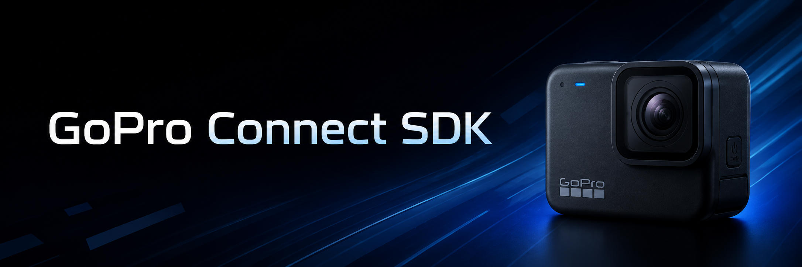

  

  <strong>Swift SDK for GoPro cameras.</strong>

  
  
  

---

The GoPro Connect SDK is a **closed-source, commercially distributed** Swift library. This repository is public for issue tracking and documentation only — the SDK binaries are not hosted here.

> [!NOTE]
> Register and download the latest release at [gopro.com](TBD).

It provides a single unified API for the full camera integration lifecycle:

| Capability | Description |
|---|---|
| **Discover** | Scan for nearby GoPro cameras over BLE |
| **Connect** | Pair and maintain a reliable camera connection |
| **Observe** | Subscribe to live camera state — mode, battery, recording status |
| **Control** | Start/stop capture, change settings, trigger media actions |
| **Retrieve** | Browse and download media from the camera's SD card |

## Requirements

- iOS 16+
- Swift 5.9+
- Xcode 15+

## Download

[Register and download the latest SDK → at gopro.com](TBD)

## Documentation

[View the API documentation →](https://gopro.github.io/camera-swift-sdk)

## Issues

Bug reports and feature requests are welcome. Please [open an issue](../../issues/new/choose) rather than emailing support — public issues help the whole community and allow GoPro to track and prioritize feedback.

Before filing, search [existing issues](../../issues) to avoid duplicates.

## Related SDKs

> [!TIP]
> See the [GoPro Connect SDK for Android/KMP (Kotlin)](https://gopro.github.io/camera-kotlin-sdk)
